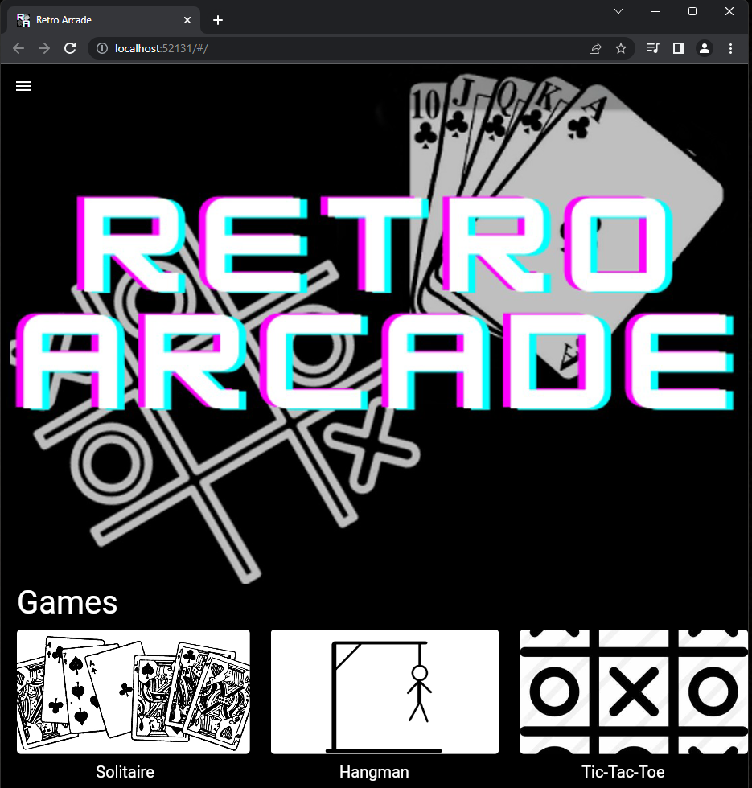

# Sprint Ceremony Minutes

Date: 2022-10-27
Members present:
* Elizabeth Mittel
* Nicholas Gathof
* John Hatton
* Jacob Riggs

## Demo
This sprint, we completed:
* Hangman Testing
* Testing Document
* Hangman Definition
* Unit Testing Backend
* Fixing Tic-Tac-Toe

Here are screenshots of what we did:

## Retro
[What is a Sprint Retrospective](https://www.scrum.org/resources/what-is-a-sprint-
retrospective)
### Good
* Finished Hangman and Tic-tac-toe
* Met regularly
* Figured out Testing

### Bad
* Check if any pull requests exists, before making one

### Actionable Commitments
* Check before submitting pull request

## Planning
(This section can and should be completed in your GitHub projects, but please
summarize here)
Points | Story
-------|--------
2      | Solitaire Card Design
2      | Solitaire Page Skeleton
2      | Solitaire UI Design
2      | Manually Test Hangman
2      | Manually Test Tic-Tac-Toe
2      | Finish Unit Testing Backend
